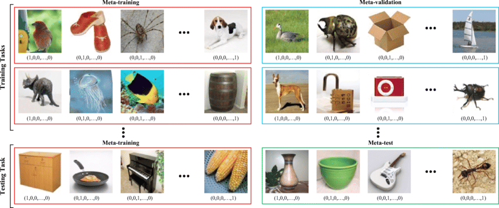
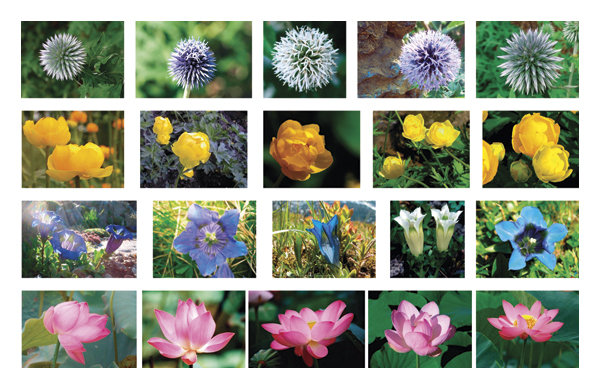
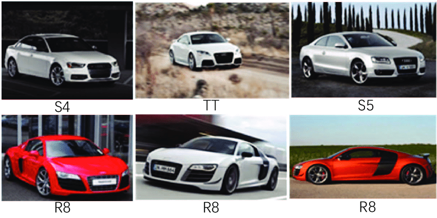

# Few-Shot learning with Prototypes Networks
Simple implementation of prototypical networks in few shot learning

[](https://github.com/fabian57fabian/prototypical-networks-few-shot-learning/actions/workflows/ci.yml)
[](https://coveralls.io/github/fabian57fabian/prototypical-networks-few-shot-learning)

<a href="https://colab.research.google.com/drive/1n9VW7-_dtoF-0BV1IFq5-QpMOilxheaU">
        </a>

<details>
<summary>Installation</summary>

Create a conda/virtualenv with all necessary packages:

### Conda

`conda create --name fs-learn`

`conda activate fs-learn`

`conda install pytorch torchvision torchaudio -c pytorch`

`conda install --file requirements.txt`

### Venv

`python3 -m pip install virtualenv`

`virtualenv venv-fs-learn`

`source venv/bin/activate`

`python3 -m pip install torch torchvision`

`python3 -m pip install ./requirements.txt`

</details>

<details>
<summary>Datasets</summary>

We used 3 main classification datasets:
- **mini_imagenet**: a collection of 100 real-world objects classes as rgb images.
  - total: 60,000
  - splits: 64 train, 16 val, 20 test (according to Vinyals et al)
  - Used in paper
  - 
- **omniglot**: a collection of 1623 classes of handwritted characters. Each image is then rotated 3 more times by 90 degrees.
  - total: 32460 real, plus 4 rotations per image
  - splits: 1032 train, 172 val, 464 test (according to Vinyals et al)
  - Used in paper
  - 
- **flowers102**: a collection of 102 real-world flowers classes as rgb images.
  - total: 32460 real, plus 4 rotations per image
  - splits: 64 train, 16 val, 22 test (random seed for splits)
  - **NOT** Used in paper
  - 
- **stanfors_cars**: a collection of 192 real-world cars classes as rgb images.
  - total: 9999999
  - splits: 60% train, 20% val, 30% test (random seed for splits)
  - **NOT** Used in paper
  - 
</details>

<details open>
<summary>Usage</summary>

The starter script is **meta_train.py** that has all necessary params to meta-train and meta-test on a dataset.

To replicate the results, launch this training (writes to runs/train_X):

```bash
python meta_train.py --data mini_imagenet \
                --episodes 200 \
                --device cuda \
                --num-way 30 \
                --query 15 \
                --shot 5 \
                --val-num-way 5 \
                --iterations 100 \
                --adam-lr 0.001 \
                --adam-step 20 \
                --adam-gamma 0.5 \
                --metric "euclidean" \
                --save-period 5 \
                --patience 10 \
                --patience-delta 0.01
```

Implemented datasets are [omniglot, mini_imagenet, flowers102, stanford_cars]:

To **train** with your **own custom dataset**, set --dataset toy our dataset folder. 
<br/>
Rember, your custom dataset should have this format:

```bash
├── train
│   ├── class1
│   │   ├── img1.jpg
│   │   ├── ...
│   ├── class2
│   │   ├── ...
│   ├── ...
├── val
│   ├── class3
│   │   ├── img57.jpg
│   │   ├── ...
│   ├── class4
│   │   ├── ...
│   ├── ...
├── test
│   ├── class5
│   │   ├── img182.jpg
│   │   ├── ...
│   ├── class6
│   │   ├── ...
│   ├── ...
```


To meta-test, use **meta_test.py** script:

```bash
python meta_test.py --model "your_model_or_pretrained.py" \
                --data mini_imagenet \
                --iterations 100 \
                --device cuda \
                --val-num-way 15 \
                --query 15 \
                --shot 5 \
                --metric "euclidean"
```

To learn centroids for new data, use **learn_centroids.py** script (writes to runs/centroids_Y):

```bash
python learn_centroids.py --model "your_model_or_pretrained.py" \
                --data your_folder_with_classes_of_images \
                --imgsz 64 \
                --channels 3 \
                --device cuda
```

This will take all classes inside _your_folder_with_classes_of_images_ dir and calculate centroids for classification task.


To use centroids for classification on new images, use **predict.py** script (outputs results):

```bash
python predict.py --model "your_model_or_pretrained.py" \
                --centroids runs/centroids_0 \
                --data a_path_with_new_images \
                --imgsz 64 \
                --device cuda
```

This will perform predictions by printing out all classes based on images in _a_path_with_new_images_ .

</details>

<details open>
<summary>Experiments</summary>

### Training datasets info

| Dataset | Images<br><sup>(shape) | Embeddings<br><sup>(shape) | Duration<br><sup>(Colab T4) |
|---------|------------------------|----------------------------|-----------------------------|
| mini_imagenet | (84, 84, 3)            | (batch, 1600)              | gpu / 1h43m                 |
| omniglot | (28, 28, 1)            | (batch, 60)                | gpu / 2h32                  |
| flowers102 | (74, 74, 3)            | (batch, 1024)              | gpu / 58m                   |
| stanford_cars | (90, 90, 3)            | (batch, 1024)              | gpu / 1h52m                 |


### 1-shot vs few-shot

Lots of experiments were done using basic paper's data by replicating the training.
All of these uses **nway=30**, **epochs=200** and **iterations_per_epoch=100** for training.
Then evaluation is performed in different n-ways and k-shots.

| Dataset       | Paper res<br>5-way 5-shot<br><sup>(Acc) | Our res<br>5-way 5-shot<br><sup>(Acc)                                                                                             | Paper res<br>5-way 1-shot<br><sup>(Acc) | Our res<br>5-way 1-shot<br><sup>(Acc)                                                                                             |
|---------------|-----------------------------------------|-----------------------------------------------------------------------------------------------------------------------------------|-----------------------------------------|-----------------------------------------------------------------------------------------------------------------------------------|
| mini_imagenet | 68.20                                   | [63.62](https://github.com/fabian57fabian/fewshot-learning-prototypical-networks/blob/main/results/mini_imagenet/train_5shot.png) | 49.42                                   | [46.13](https://github.com/fabian57fabian/fewshot-learning-prototypical-networks/blob/main/results/mini_imagenet/train_1shot.png) |
| omniglot      | 98.80                                   | [97.77](https://github.com/fabian57fabian/fewshot-learning-prototypical-networks/blob/main/results/omniglot/train_5shot.png)      | 98.8                                    | [91.93](https://github.com/fabian57fabian/fewshot-learning-prototypical-networks/blob/main/results/omniglot/train_1shot.png)      | 
| flowers102    | /                                       | [84.48](https://github.com/fabian57fabian/fewshot-learning-prototypical-networks/blob/main/results/flowers102/train_5shot.png)    | /                                       | [56.08](https://github.com/fabian57fabian/fewshot-learning-prototypical-networks/blob/main/results/flowers102/train_1shot.png)    | 
| stanford_cars | /                                       | [51.87](https://github.com/fabian57fabian/fewshot-learning-prototypical-networks/blob/main/results/stanford_cars/train_5shot.png) | /                                       | /                                                                                                                                 | 

### Euclidean vs cosine distances

Cosine experiments were done on 5-way 5-shot configurations.
Same results for similar 1-shot and 20-way trainings.

| Dataset       | Cosine<br><sup>(acc) | Euclidean<br><sup>(acc) |
|---------------|---------------------|-------------------------|
| mini_imagenet | 22.36               | **63.62**               |
| omniglot      | 23.48               | **97.77**               |
| flowers102    | 82.89               | **84.48**               |
| stanford_cars | ____                | **51.87**               |


</details>
